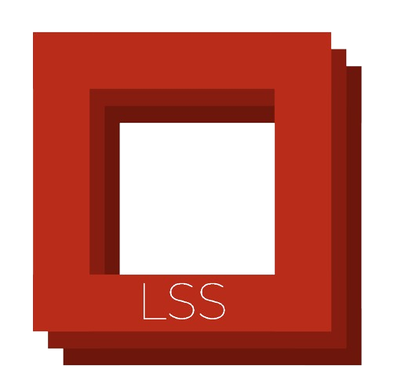
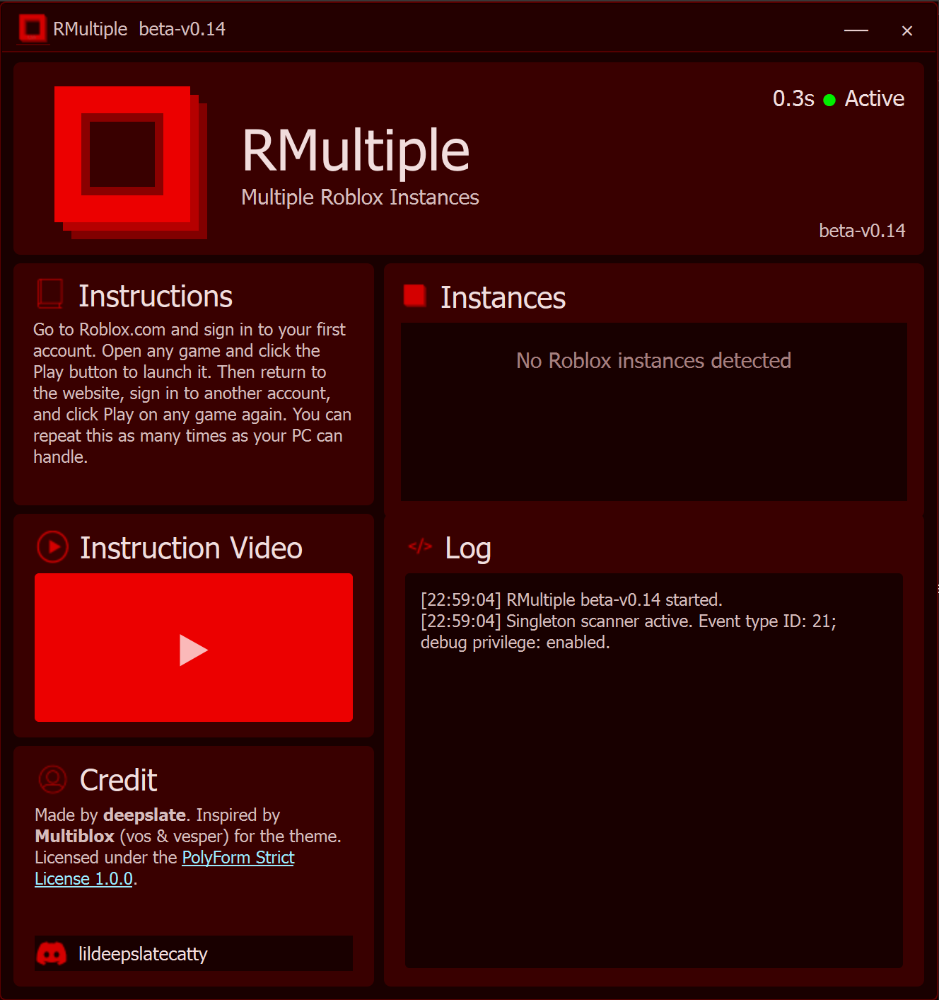

  

<h1 align="center">RMultiple</h1>

  A lightweight Windows utility for launching and managing multiple Roblox client instances.

---

## Features

- Runs multiple Roblox client instances
- Detects active Roblox processes
- Shows PID, CPU, GPU, and RAM usage
- Lets you close a specific Roblox instance
- Removes the Roblox singleton event automatically
- Frameless, resizable interface
- Built-in instruction video support
- Standalone EXE available

## Preview

  

## Download

The official builds are available from this repository's Releases page:

[Download RMultiple](../../releases)

Only download RMultiple from this repository or links posted by **deepslate**.

## Running from source

### Requirements

- Windows 10 or Windows 11
- 64-bit Python
- Administrator permission

Missing Python dependencies are installed automatically.

## Discord

Questions, bug reports, ideas, or permission requests can be sent to **deepslate**:

[Discord profile](https://discord.com/users/1213679853627244596)

Ask there if something is not working, or tell me first if you want to redistribute, bundle, mirror, or otherwise share RMultiple somewhere else.

## Credits

Made by **deepslate**.

The interface theme was inspired by **Multiblox** by **vos** and **vesper**.

## License

RMultiple is licensed under the **PolyForm Strict License 1.0.0**.

See the [`LICENSE`](LICENSE) file for the full terms.

yes i would like to take your money but i just feel like not to so no i won't take your money also pls dont reverse engineer my little exe plsss
